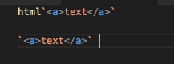

# VS Code JavaScript Template String Grammar Injection Example

Demonstrates how an extension can inject syntax highlighting for a specific language into a JavaScript template string. This example demonstrates colorizing html template strings of the forms:

```js
html`<a>text</a>` 

`<a>text</a>` 
```

